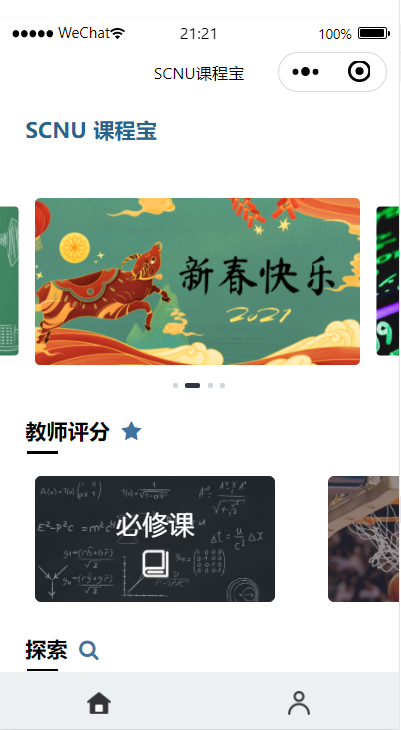
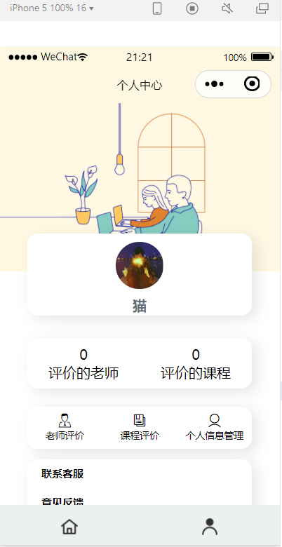
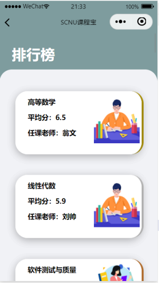
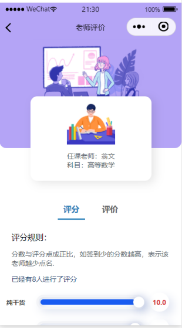
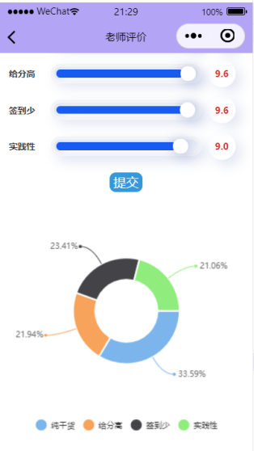
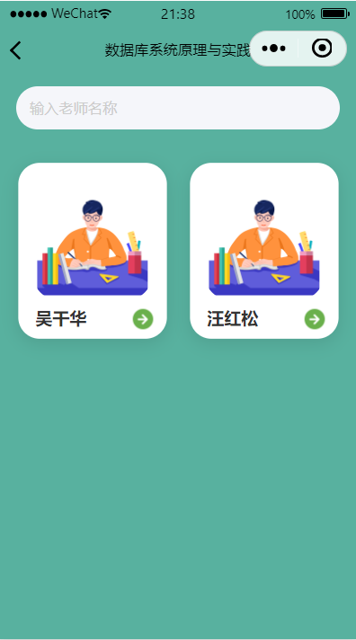
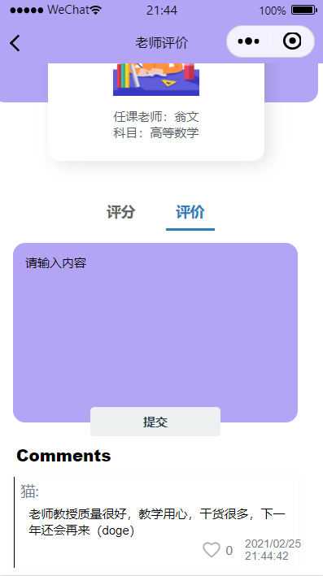

# 📘 SCNU ClassEval - Teaching Evaluation Mini Program

**SCNU ClassEval** is a WeChat mini program designed to enhance classroom feedback mechanisms in universities by enabling students to rate and comment on teachers and courses. Developed by undergraduate students at **South China Normal University**, the app bridges the gap between students and faculty through real-time, structured feedback.

---

## 🚀 Features

- **Course Evaluation**: Students can evaluate both compulsory and elective courses based on four key dimensions:  
  *content richness, fairness in grading, attendance policies, and practical relevance*.
- **Teacher Leaderboard**: View ranked lists of the most popular and highest-rated instructors.
- **Comment & Feedback System**: Submit written feedback and upvote others' comments.
- **Course Material Sharing**: Peer-shared course materials available for practice and review.
- **User Center**: Personal evaluation history, account info, and feedback submission.

---

## 🎯 Target Users

- **Students**: Provide anonymous and structured feedback to improve teaching quality.
- **Teachers**: View real feedback and suggestions to refine teaching approaches.

---

## 🧩 Technology Stack

- **Frontend**: WeChat Mini Program (ColorUI, WXML/CSS)
- **Backend**: WeChat Cloud Development (Cloud Database, Cloud Functions)
- **Database**: Tables for Users, Teachers, Courses, Ratings, and Comments

---

## 📱 Usage Scenarios

- Choosing elective courses based on peer reviews
- Providing feedback during or after class
- Allowing administrators to reference feedback data in evaluations

---

## 👨‍💻 Development Team

- **Frontend**: Jiayi Chen, Zixuan Liang  
- **Backend**: Canbin Huang, Junting Li

---

## 📸 UI Preview

| Main Page | Login Page | Ranking Page |
|-----------|------------|--------------|
|  |  |  |

| Course Page | Evaluate Page 1 | Evaluate Page 2 |
|-------------|------------------|------------------|
|  |  |  |

| Teacher Page | Typing Page |
|--------------|-------------|
|  |  |

---

## 📂 Source Code

Full project source code is available in the [`master`](https://github.com/S-Joy/SCNU-ClassEval/tree/master) branch.  
It includes all frontend and backend files, database schema, and development scripts.

---

## 🎥 Promotional Video

Watch the demo video in the `master` branch or [click here](#) to view (replace this with actual video link).

---

## 🤝 Collaboration & Deployment

This project can be adapted and expanded for broader academic institutions.  
For deployment instructions or collaboration inquiries, feel free to reach out.

---

**📌 Project Version**: 1.1.2  
**🧭 Platform**: WeChat Mini Program  
**🏫 Institution**: South China Normal University
